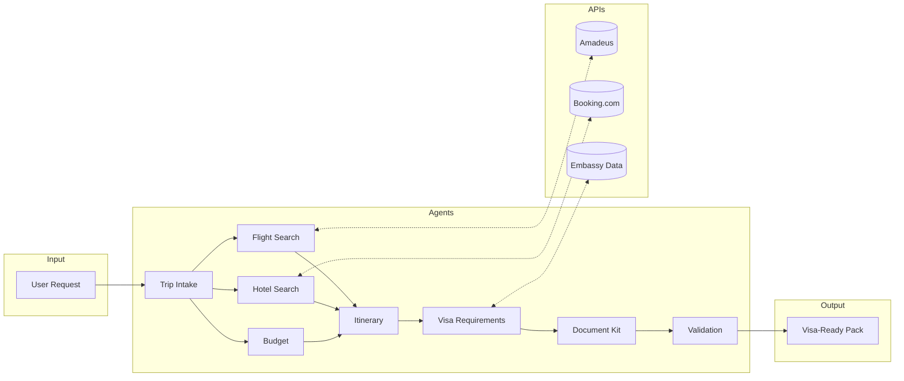

# VPAgent

**Multi-agent travel assistant for visa-ready itinerary planning**

VPAgent generates complete visa-ready travel packs — coordinating flights, hotels, and embassy documentation into a single streamlined output. It uses a multi-agent architecture with ~10 specialized agents that collaborate through tool-calling, state passing, and orchestrated handoffs.

## Architecture



**Agent Responsibilities:** Trip Intake (parse/validate requests) → Flight Search (Amadeus API) → Hotel Search (Booking.com API) → Budget (cost tracking) → Itinerary (assemble plan) → Visa Requirements (destination rules) → Document Kit (embassy checklists) → Validation (final checks)

**Why hand-rolled orchestration?** The current implementation uses explicit Python modules rather than LangGraph/CrewAI. Building from scratch first ensures deep understanding of agent boundaries and state management before abstracting. Framework integration planned as requirements stabilize.

## Roadmap

- [ ] Framework layer (evaluating LangGraph, CrewAI)
- [ ] Additional API partners (Priceline pending)
- [ ] Travel insurance agent
- [ ] Schengen document automation
- [ ] Web/mobile client MVPs (scaffolds in `/clients`)

## Getting Started

1. Copy `.env.example` to `.env` and fill in secrets
2. `pip install -r requirements.txt`
3. Add provider credentials (Amadeus, RapidAPI Booking.com) to `.env`
4. `uvicorn vp_generator.api:app --reload`
5. (Optional) `python main.py sample_request.json` for local testing

## API

| Method | Endpoint | Description |
|--------|----------|-------------|
| GET | `/health` | Readiness probe |
| POST | `/visa-pack` | Returns generated travel pack |

## Sample Data

- `sample_request.json` – Two-traveller France trip
- `sample_response.json` – Captured API response for UI prototyping

> `primary_destination_country` must match one of the `destination_countries`.

## Testing

```bash
pytest
```

## Clients

Web (Next.js) and mobile (Expo) scaffolds in `clients/`. Regenerate `clients/openapi.json` after backend changes.

---

⚠️ Never commit `.env` or API keys to version control.
